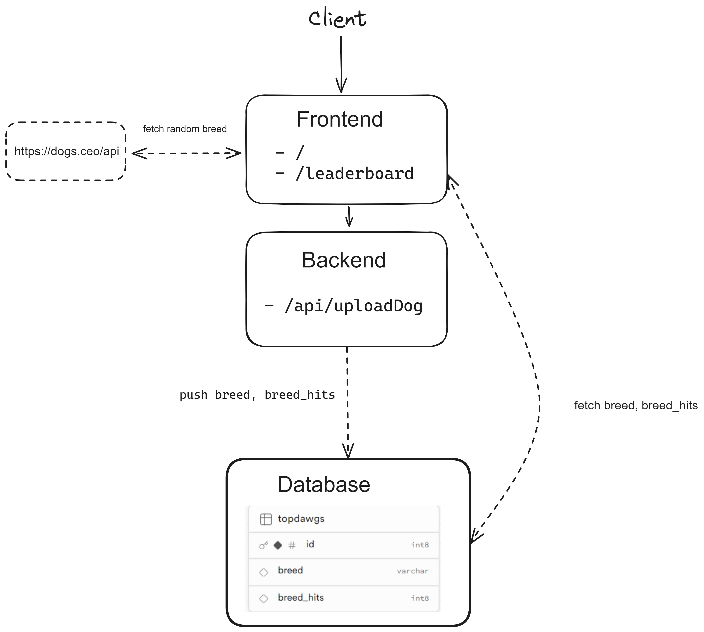

# Dokumentacja projektu na zaliczenie zajęć Programowanie aplikacji internetowych Lato 2024

[https://github.com/fulcrum29/zaliczenie-aplikacje-internetowe](https://github.com/fulcrum29/zaliczenie-aplikacje-internetowe)

## Temat projektu

Tematem projektu jest aplikacja internetowa pozwalająca na ocenianie różnych ras psów.

## Opis projektu

Aplikacja pozwala na ocenę różnych ras psów oraz porównanie najczęściej wybieranych ras na podstawie otrzymanych liczby głosów.

Najlepsze 5 ras pojawia się w rankingu wraz z ilością otrzymanych głosów. 
Ranking wyświetlany jest również w formie wykresu słupkowego.

## Wymagania

Po otwarciu strony, aplikacja powinna pobrać 3 losowe rasy psów tj. nazwa rasy wraz ze zdjęciem i wyświetlić je użytkownikowi.
Użytkownik powinien mieć możliwość wybrania jednej rasy. Po każdym wybraniu rasy komponent wyswietlający psy powinnien się dynamicznie (bez innej interakcji użytkownika) odświeżyć wyświetlając kolejne rasy psów.
Każdy głos oddany przez użytkownika powinien zostać wysłany do "backendu" skąd powinien zostać zapisany w bazie danych.
Zagłosowanie polega na wysłaniu z frontendu do backendu nazwy rasy, skąd sprawdzane jest czy dana rasa istnieje już w bazie, jeżeli nie istnieje to utowrzony zostaje rekordu z nazwą danej rasy i dodanie głosu.  
Pod adresem `/leadearboad` powinien być dostępny ranking psów generowany na podstawie wykonanych głosów. Ranking powinien zawierać zdjęcie rasy wraz z ilością oddanych głosów. Przycisk `Pokaż wykres` powinien generować wykres słupkowy przedstawiający rozkład oddanych głosów na 5 najczęściej wybieranych ras. Przycisk powinien pozwolic na wrócenie do rankingu w formie zdjęcie-liczba głosów.

## Odbiorcy

Odbiorcami aplikacji są miłośnicy psów.

## 


## Użyte technologie i API

### Frontend:
 - React
 - CSS
 - HTML
 - Axios (do zapytan dla zewnetrznego API)
 - [Dog API](https://dog.ceo/dog-api/) (do pobierania zdjęć i nazw ras psów)

### Backend:
 - NextJS (`/api/uploadDog`)
 - Supabase (Postgres SaaS jako baza danych)

## Użycie

### Aplikacja dostępna jest na platformie vercel pod adresem \ 
[https://zaliczenie-aplikacje-internetowe.vercel.app](https://zaliczenie-aplikacje-internetowe.vercel.app)

### Do poprawnego działania aplikacji wymagana jest darmowa baza danych [Supabase](http://supabase.com)
#### Tabela o nazwie `topdawgs` powinna zawierać 3 kolumny:
 - id (int8, primary_key, autoincrement)
 - breed (varchar)
 - breed_hits (int8)
#### Zmienne środowiskowe z danymi dostępowymi do bazy powinny być zapisane pod kluczami
- `NEXT_PUBLIC_SUPABASE_URL`
- `NEXT_PUBLIC_SUPABASE_ANON_KEY`

### Przed uruchomienien aplikacji wymagane jest zainstalowanie zależności przy pomocy polecenia:

```npm install```

### Po poprawnej instalacji możemy uruchomić aplikacje za pomocą polecenia:
```npm run dev```

Po uruchomieniu aplikacja powinna być dostępna pod adresem [http://localhost](http://localhost:3000)


## Schemat aplikacji


